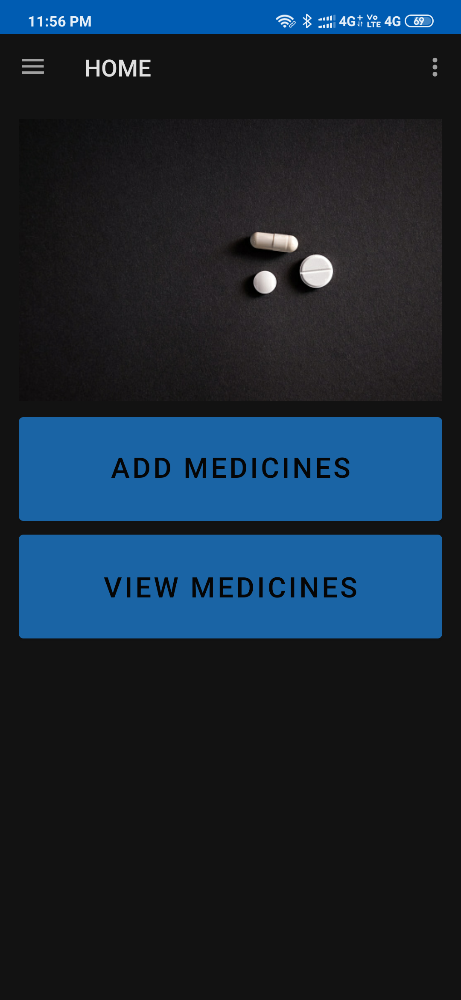
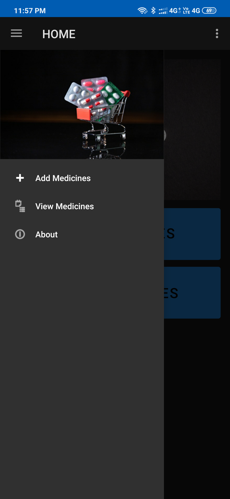
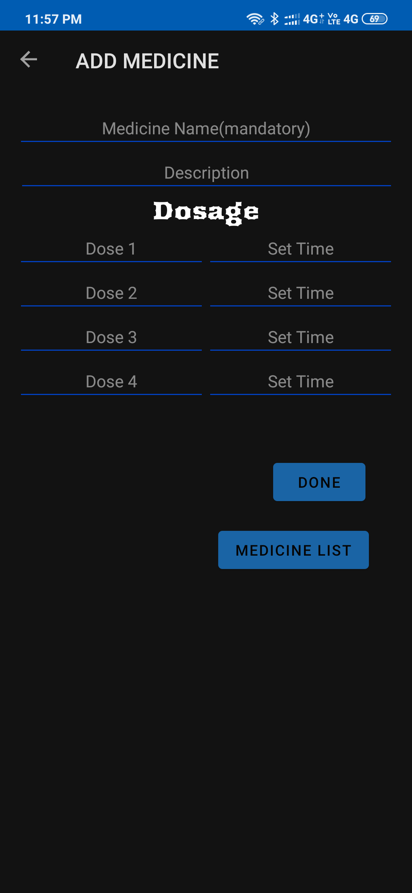
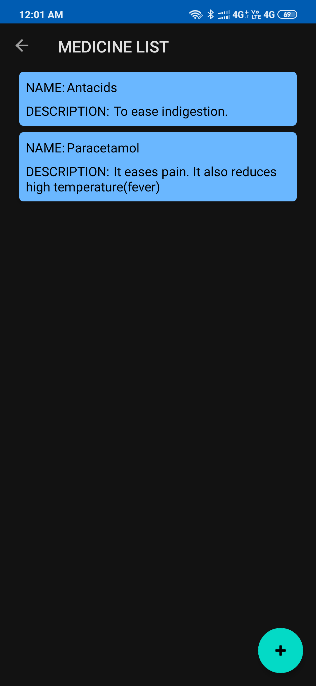

# My_Medications
This is my project for #30DaysOfKotlin

This is an app to store some information about the medicine:
(1)Name of the Medicine
(2)Description for medicine: to know what a particular medicine is used for.
(3)You can also add the number of pills or quantity of medicine or syrup u need to take in the dosage section.
(4)Daily doses' timing can also be added such as in morning, in afternoon, in evening or before bed you can also 
   add particular time for each medicine like 12pm, 9am, etc.
   
Used room database to store a list of medications, used viewmodel and viewmodelFactory classes to use live data and navigate between fragments, used data bindings, and also recyclerView to show the list of medications created by user. Used coroutines for threading. Also used data class to temporarily store data and then pass it into room database. And at last used material design themes to improve the UI.

